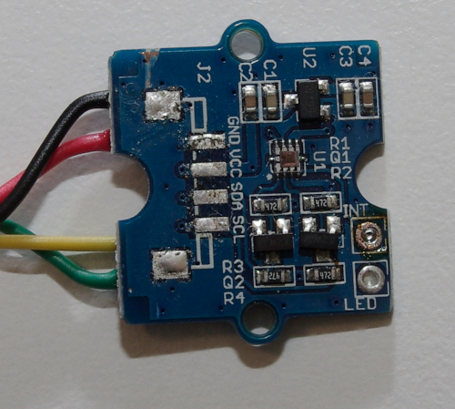
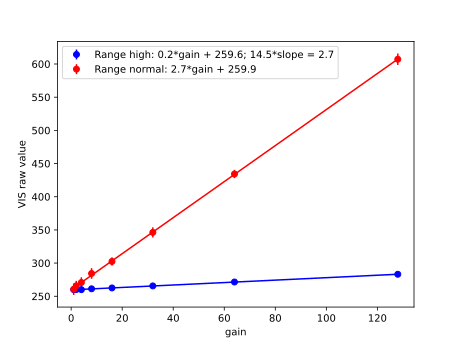
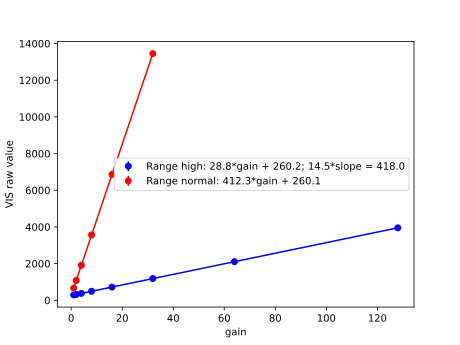

# Si1145 lightsensor

The Si1145 is a light and proximity sensor ([datasheet](https://www.silabs.com/documents/public/data-sheets/Si1145-46-47.pdf)). It can be used to measure ambient sunlight and was used by version 1 of the [Grove Sunlight Sensor](https://wiki.seeedstudio.com/Grove-Sunlight_Sensor/), which is a breakout board for that sensor chip. Unfortunately that board has a connector mounted such that it shades the sensing chip, so the first action is obviously to remove this connector. Fortunately the PCB has pins on the bottom on which cables can be soldered.

Here the interest is measuring ambient sunlight, therefore in the following proximity measurements are not considered.
The chip has three photodiodes, one for visible light and two for the near infrared (NIR), a larger and a smaller one.
For NIR, one of the two photodiodes can be selected to adjust the sensitivity.
For each photodiode, the exposure time can be increased in 8 steps in powers of 2 (called "gain" by the data sheet).
A "high range" mode allows an additional decrease of the exposure time by a factor of 14.5 to measure in bright sunlight.
This HAL implements a simple auto-exposure to choose the best suitable settings for the conditions at hand, i.e. such that the ADC is neither under- nor overexposed and the signal-to-noise ratio is ideal.

The lux value can be computed as:

_E = (I - I0) / g * c / s_

where _I0_ is the dark current, _g_ the gain, and _c_ the range factor (i.e. 14.5 for high range and 1 for normal range). According to the datasheet, the sensitivity to sunlight is _s_ = 0.282 ADC counts per lux at gain 1 in normal mode.

To characterise the sensor, test measurements have been done.
The first step was an exposure series, i.e. measurements of the same signal at all available exposure times, in several different conditions.

The first graph shows a measurement in a dark room (very low light), the second one a measurement outside at 1539lx (as measured with a luxmeter).
20 measurements were done for each "gain" and the mean and standard deviation (shown as error bars) computed.
A linear regression was done on the raw data to compute a linear fit.
The graphs show that the sensor is nicely linear.
The dark current can be estimated from the y axis intercept to _I0_ = 260 counts.
